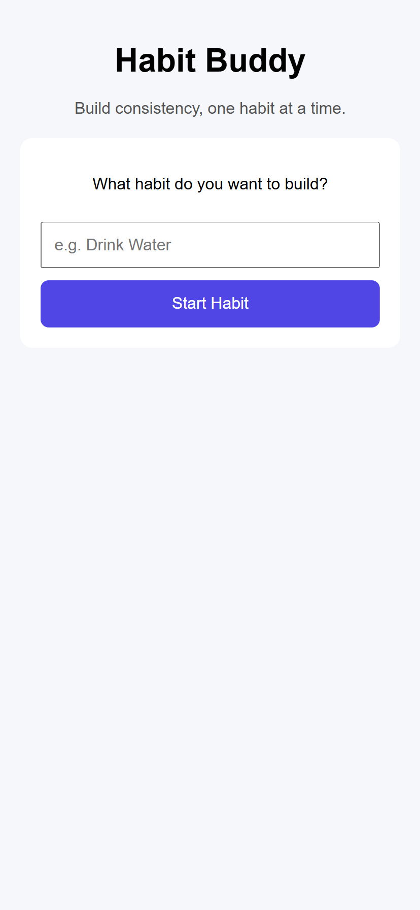
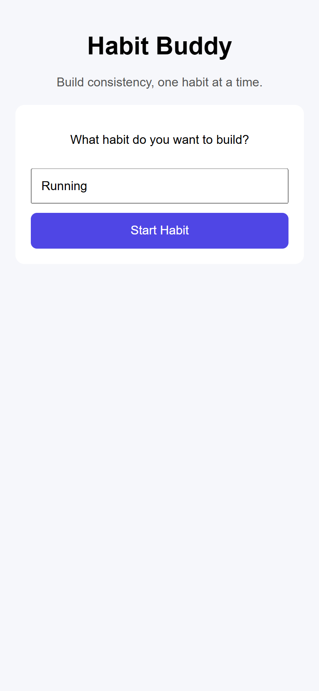
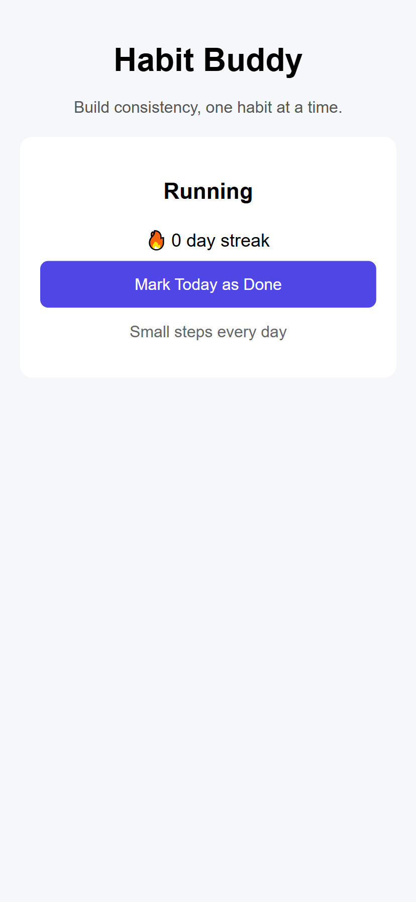
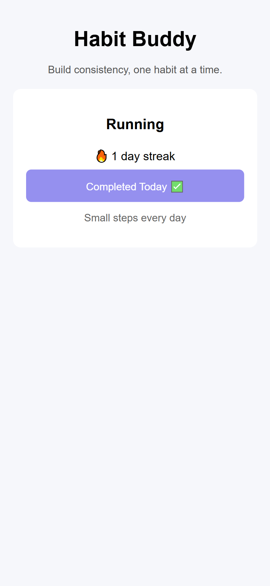

# Habit Buddy 🧠🔥

Habit Buddy is a minimal habit-tracking web application that helps users build consistency by focusing on **one habit at a time**.

Instead of overwhelming users with multiple habits, the app encourages simplicity and daily action through a clean, mobile-friendly interface.

---

## 🚀 Live Demo

👉 **Live App:** https://habbit-buddy-six.vercel.app/
---

## ❓ Problem Statement

Many habit-tracking apps allow users to track multiple habits at once, which often leads to cognitive overload and inconsistency—especially for beginners.

---

## 💡 Solution

Habit Buddy intentionally limits users to tracking **only one habit** at a time.  
This design choice helps users stay focused, reduce friction, and build long-term consistency.

Key ideas:
- One habit → more focus
- One action per day → less pressure
- Simple UI → daily usability

---

## ✨ Features

- Create a single habit
- Daily check-in system
- Automatic streak tracking
- Prevents multiple check-ins on the same day
- Mobile-first, responsive design
- No login required (uses local user identifier)

---

## 🖼️ Screenshots

<p align="center">
  
  
  
  
</p>

<p align="center">
  <b>Home</b> · <b>Add Habit</b> · <b>View Habit</b> · <b>Completed</b>
</p>

---

## 🛠️ Tech Stack

**Frontend**
- React
- CSS (mobile-first design)
- Axios

**Backend**
- Node.js
- Express.js
- MongoDB (Atlas)

**Deployment**
- Frontend: Vercel
- Backend: Render

---

## 🧠 How It Works

1. A unique user ID is generated and stored locally in the browser.
2. Each user can create only one habit.
3. Users can check in once per day.
4. The backend updates the streak based on daily consistency.
5. Data is persisted using MongoDB.

This approach avoids login complexity while still maintaining separate user data.

---

## 📚 What I Learned

- Full-stack MERN development
- Designing with intentional constraints
- Building mobile-first user interfaces
- Handling simple multi-user logic without authentication
- Deploying real-world applications

---

## 🔮 Future Improvements

- User authentication
- Multiple habits per user
- Habit reminders and notifications
- Analytics and progress insights

---

## 🏆 Hackathon Submission

This project was built as part of **CodeSprout Beginner’s Hackathon 2026**, focusing on clarity, usefulness, and beginner-friendly execution.

---

## 📦 Local Setup (Optional)

```bash
# Backend
cd server
npm install
node index.js

# Frontend
cd client
npm install
npm start
